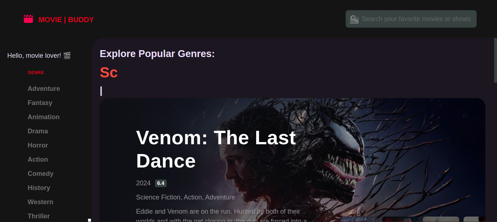

# Movie | Buddy

Movie Buddy is a web app that helps plan movie nights by suggesting movies based on user preferences and trends. Using the  TMDB API, users can search movies by title or genre, view posters and ratings, add movies to a watchlist, and receive personalized recommendations for an enjoyable movie experience.

## Movie Buddy Features :

 - **1. Movie Discovery:** Explore movies across diverse genres with a searchable interface.
- **2. Detailed Movie Information**: Access comprehensive details, including descriptions, cast, and ratings.
- **3. Trailers and Links**: View movie trailers and access related external resources.
- **4. User-Friendly Navigation**: Simple and clean layout for seamless browsing.

## Technology Stack :

The Movie Buddy project uses the following technologies and stacks:

## Frontend:

- **HTML5**: Structure and content of web pages.
- **CSS3**: Styling and layout.
- **JavaScript**: Interactivity and dynamic content.
  
  ## API Integration:
- **TMDB API**: For retrieving movie data, including titles, genres, posters, ratings, and recommendations.
  
## Deployment:
- **Vercel**: Hosting and deployment.
  
## Development Tools:
Modular JavaScript files for scalability.

## Future Improvements:

- **Enhanced Recommendation System**: Introduce personalized recommendations based on user watch history and ratings.
- **User Accounts**: Allow users to create profiles, save watchlists, and sync preferences.
- **Social Features**: Enable sharing watchlists and movie reviews with friends.
- **Improved UI/UX**: Add animations, better visuals, and responsive design.
- **Advanced Filters**: Include filters for directors, release years, or languages.
  
## Usage Scenarios:

- **Discover movies based on genres or trends.**
- **Create a curated watchlist for binge sessions.**
- **Explore movie trailers and ratings to decide what to watch.**

  ## Contributing

Contributions to the project are highly encouraged. If you have suggestions for enhancements or wish to report issues, please submit a pull request or open an issue on the repository.

## License

This project does not currently have a specified license. Users are free to utilize and modify the application as needed.

## Acknowledgments

I extend my gratitude myself as a contributor/developer and users for their valuable feedback and support.

